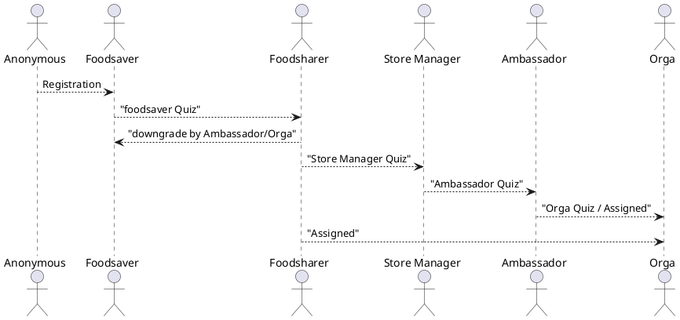

# Permissions and Roles

## Introduction

The foodsharing platform have different type of user management. The combination of the user management with the component related permissions define the user specific foodsharing platform possibilities.

### User roles

The user role is an account level. The account levels enable access to a set of possibilities. The user can arrive the next account level by a qualification via quiz and a responsible in a higher level.

### Groups

The foodsharing platform contains different group. The groups represent organization units, e.g. stores, region, city and working groups and the GOAL-groups. This group manage possibilities inside the platform. A member of the store can be part of a pick-up from the store, or a member of a region can discuss in the forum of the region.

#### Regions / Working Groups

A organization separation of the foodsharing community for managin by ambassadors.
There are unrestricted and restricted regions and groups.

#### GOAL Groups

A groups which support the ambassador to manage the region. It allows to give permissions to other users which typical an ambassador has.

#### Store Members

Part of a store and can work inside of the store module to take part of a pick-up or not.

### Permissions

The platform parts of the foodsharing provide permissions. This permission is used to classify the users and restrict possibilities of the part depending on his group and role.

Examples:

- A full store member has the permission to be part of a pick-up.
- A foodsaver can change his profile information.
- A foodsaver can't change the profile information of another foodsaver, only ambassador of the foodsaver from a region can change the profile information to.

## Permission role mapping

| Module | Permission | Anonym | Foodsaver | Foodsharer | Store Manager (same) | Store Manager (other) | Orga |
|--------|------------|---------------------|----| ----- | ----- | ----- | ----- |
| Basket | [Request the basket](https://gitlab.com/foodsharing-dev/foodsharing/-/blob/1ba084ebe0091ae14ebaeae02b56b8adc4530187/src/Permissions/BasketPermissions.php#L17) | | X | X | X | X | X |
| Basket | [Create basket](https://gitlab.com/foodsharing-dev/foodsharing/-/blob/1ba084ebe0091ae14ebaeae02b56b8adc4530187/src/Permissions/BasketPermissions.php#L26) | | X | X | X | X | X |
| Basket | [Modify basket](https://gitlab.com/foodsharing-dev/foodsharing/-/blob/1ba084ebe0091ae14ebaeae02b56b8adc4530187/src/Permissions/BasketPermissions.php#L31) | | X | X | X | X | X |
| Basket | [Delete basket](https://gitlab.com/foodsharing-dev/foodsharing/-/blob/1ba084ebe0091ae14ebaeae02b56b8adc4530187/src/Permissions/BasketPermissions.php#L40) | | X | X | X | X | X |
| User | [View User Details](https://gitlab.com/foodsharing-dev/foodsharing/-/blob/1ba084ebe0091ae14ebaeae02b56b8adc4530187/src/Permissions/UserPermissions.php#L16) | X | X | X | X | X | X |
| Store | [Send Join request](https://gitlab.com/foodsharing-dev/foodsharing/-/blob/1ba084ebe0091ae14ebaeae02b56b8adc4530187/src/Permissions/StorePermissions.php#L37) |  |   | X | X | X | X |
| Store | [Add User to Store team](https://gitlab.com/foodsharing-dev/foodsharing/-/blob/1ba084ebe0091ae14ebaeae02b56b8adc4530187/src/Permissions/StorePermissions.php#L59) | | | | X | | X |
| Store | [Edit store team](https://gitlab.com/foodsharing-dev/foodsharing/-/blob/1ba084ebe0091ae14ebaeae02b56b8adc4530187/src/Permissions/StorePermissions.php#L212) | | | | X |  | X |
| Store | [Edit store](https://gitlab.com/foodsharing-dev/foodsharing/-/blob/1ba084ebe0091ae14ebaeae02b56b8adc4530187/src/Permissions/StorePermissions.php#L182) | | | | X | | X |
| Store | [Leave store team](https://gitlab.com/foodsharing-dev/foodsharing/-/blob/1ba084ebe0091ae14ebaeae02b56b8adc4530187/src/Permissions/StorePermissions.php#L75) | | X | X | X | X | X | 
| Store | [View store](https://gitlab.com/foodsharing-dev/foodsharing/-/blob/1ba084ebe0091ae14ebaeae02b56b8adc4530187/src/Permissions/StorePermissions.php#L83) | | X | X | X | X | X |
| Store Wall | [View store wall](https://gitlab.com/foodsharing-dev/foodsharing/-/blob/1ba084ebe0091ae14ebaeae02b56b8adc4530187/src/Permissions/StorePermissions.php#L110) |  |
| Store Wall | [Write to store wall](https://gitlab.com/foodsharing-dev/foodsharing/-/blob/1ba084ebe0091ae14ebaeae02b56b8adc4530187/src/Permissions/StorePermissions.php#L137) |  |
| Store wall | [force delete store wall post](https://gitlab.com/foodsharing-dev/foodsharing/-/blob/1ba084ebe0091ae14ebaeae02b56b8adc4530187/src/Permissions/StorePermissions.php#L145) |  |
| Store wall | [delete store wall post](https://gitlab.com/foodsharing-dev/foodsharing/-/blob/1ba084ebe0091ae14ebaeae02b56b8adc4530187/src/Permissions/StorePermissions.php#L153) |  |
| Store | [Create store](https://gitlab.com/foodsharing-dev/foodsharing/-/blob/1ba084ebe0091ae14ebaeae02b56b8adc4530187/src/Permissions/StorePermissions.php#L177) |  |
| Store | [Modify store](https://gitlab.com/foodsharing-dev/foodsharing/-/blob/1ba084ebe0091ae14ebaeae02b56b8adc4530187/src/Permissions/StorePermissions.php#L182) |  |
| Store Pickup | [Remove User from pickup](https://gitlab.com/foodsharing-dev/foodsharing/-/blob/1ba084ebe0091ae14ebaeae02b56b8adc4530187/src/Permissions/StorePermissions.php#L217) |  |
| Store Pickup | [Confirm pickup](https://gitlab.com/foodsharing-dev/foodsharing/-/blob/1ba084ebe0091ae14ebaeae02b56b8adc4530187/src/Permissions/StorePermissions.php#L234) |  |
| Store Pickup | [Edit pickup](https://gitlab.com/foodsharing-dev/foodsharing/-/blob/1ba084ebe0091ae14ebaeae02b56b8adc4530187/src/Permissions/StorePermissions.php#L239) |  |
| Store | [Accept request **- Unused**](https://gitlab.com/foodsharing-dev/foodsharing/-/blob/1ba084ebe0091ae14ebaeae02b56b8adc4530187/src/Permissions/StorePermissions.php#L244) |  |
| Store Pickup | [Add pickup](https://gitlab.com/foodsharing-dev/foodsharing/-/blob/1ba084ebe0091ae14ebaeae02b56b8adc4530187/src/Permissions/StorePermissions.php#L249) |  |
| Store Pickup | [Delete pickup](https://gitlab.com/foodsharing-dev/foodsharing/-/blob/1ba084ebe0091ae14ebaeae02b56b8adc4530187/src/Permissions/StorePermissions.php#L254) |  |
| Store Pickup | [View pickup history](https://gitlab.com/foodsharing-dev/foodsharing/-/blob/1ba084ebe0091ae14ebaeae02b56b8adc4530187/src/Permissions/StorePermissions.php#L259) |  |
| Store Pickup | [Join pickup](https://gitlab.com/foodsharing-dev/foodsharing/-/blob/1ba084ebe0091ae14ebaeae02b56b8adc4530187/src/Permissions/StorePermissions.php#L264) |  |
| Store Pickup | [View pickups](https://gitlab.com/foodsharing-dev/foodsharing/-/blob/1ba084ebe0091ae14ebaeae02b56b8adc4530187/src/Permissions/StorePermissions.php#L277) |  |
| Store Pickup | [See Phone numbers of Team](https://gitlab.com/foodsharing-dev/foodsharing/-/blob/1ba084ebe0091ae14ebaeae02b56b8adc4530187/src/Permissions/StorePermissions.php#L282) | | 
| Store Chat | [Chat with regular team](https://gitlab.com/foodsharing-dev/foodsharing/-/blob/1ba084ebe0091ae14ebaeae02b56b8adc4530187/src/Permissions/StorePermissions.php#L287) | | 
| Store Chat| [Chat with jumpers](https://gitlab.com/foodsharing-dev/foodsharing/-/blob/1ba084ebe0091ae14ebaeae02b56b8adc4530187/src/Permissions/StorePermissions.php#L296) | | 
| Store | [Allowed to Upgrade to store manager](https://gitlab.com/foodsharing-dev/foodsharing/-/blob/1ba084ebe0091ae14ebaeae02b56b8adc4530187/src/Permissions/StorePermissions.php#L305) | | 
| Store | [can downgrades from storemanager](https://gitlab.com/foodsharing-dev/foodsharing/-/blob/1ba084ebe0091ae14ebaeae02b56b8adc4530187/src/Permissions/StorePermissions.php#L322) | | 
| Store Pickup | [View Pickup options](https://gitlab.com/foodsharing-dev/foodsharing/-/blob/1ba084ebe0091ae14ebaeae02b56b8adc4530187/src/Permissions/StorePermissions.php#338) | | 
| User Profile | [Modify Profile and User role ](https://gitlab.com/foodsharing-dev/foodsharing/-/blob/1ba084ebe0091ae14ebaeae02b56b8adc4530187/src/Permissions/ProfilePermissions.php#23) | | 
| User Profile | [Modify Profile](https://gitlab.com/foodsharing-dev/foodsharing/-/blob/1ba084ebe0091ae14ebaeae02b56b8adc4530187/src/Permissions/ProfilePermissions.php#42) | | 
| User Profile | [Allow to remove/kick User from Pickup slot](https://gitlab.com/foodsharing-dev/foodsharing/-/blob/1ba084ebe0091ae14ebaeae02b56b8adc4530187/src/Permissions/ProfilePermissions.php#47) | | 
| User Profile | [Change Verifikation Status of user](https://gitlab.com/foodsharing-dev/foodsharing/-/blob/1ba084ebe0091ae14ebaeae02b56b8adc4530187/src/Permissions/ProfilePermissions.php#52) | | 
| User Profile | [View change history of User profile](https://gitlab.com/foodsharing-dev/foodsharing/-/blob/1ba084ebe0091ae14ebaeae02b56b8adc4530187/src/Permissions/ProfilePermissions.php#57) | | 
| User Profile | [View notes about user](https://gitlab.com/foodsharing-dev/foodsharing/-/blob/1ba084ebe0091ae14ebaeae02b56b8adc4530187/src/Permissions/ProfilePermissions.php#62) | | 
| User Profile | [View pickups of user](https://gitlab.com/foodsharing-dev/foodsharing/-/blob/1ba084ebe0091ae14ebaeae02b56b8adc4530187/src/Permissions/ProfilePermissions.php#67) | | 
| User Profile | [View old Pickups of user](https://gitlab.com/foodsharing-dev/foodsharing/-/blob/1ba084ebe0091ae14ebaeae02b56b8adc4530187/src/Permissions/ProfilePermissions.php#76) | | 
| User Profile | [View Stores of user](https://gitlab.com/foodsharing-dev/foodsharing/-/blob/1ba084ebe0091ae14ebaeae02b56b8adc4530187/src/Permissions/ProfilePermissions.php#81) | | 
| User Profile | [View committment statistics of user](https://gitlab.com/foodsharing-dev/foodsharing/-/blob/1ba084ebe0091ae14ebaeae02b56b8adc4530187/src/Permissions/ProfilePermissions.php#90) | | 
| User Profile | [View foodsharing Email adress](https://gitlab.com/foodsharing-dev/foodsharing/-/blob/1ba084ebe0091ae14ebaeae02b56b8adc4530187/src/Permissions/ProfilePermissions.php#113) | | 
| User Profile | [View private e-mail address](https://gitlab.com/foodsharing-dev/foodsharing/-/blob/1ba084ebe0091ae14ebaeae02b56b8adc4530187/src/Permissions/ProfilePermissions.php#122) | | 
| User Profile | [View last login information](https://gitlab.com/foodsharing-dev/foodsharing/-/blob/1ba084ebe0091ae14ebaeae02b56b8adc4530187/src/Permissions/ProfilePermissions.php#127) | | 
| User Profile | [Delete User profile](https://gitlab.com/foodsharing-dev/foodsharing/-/blob/1ba084ebe0091ae14ebaeae02b56b8adc4530187/src/Permissions/ProfilePermissions.php#137) | | 
| User Profile | [Show email bouncing warning](https://gitlab.com/foodsharing-dev/foodsharing/-/blob/1ba084ebe0091ae14ebaeae02b56b8adc4530187/src/Permissions/ProfilePermissions.php#142) | | 
| User Profile | [Delete banana from user](https://gitlab.com/foodsharing-dev/foodsharing/-/blob/1ba084ebe0091ae14ebaeae02b56b8adc4530187/src/Permissions/ProfilePermissions.php#147) | | 
| User Profile | [Delete User from email bounce list](https://gitlab.com/foodsharing-dev/foodsharing/-/blob/1ba084ebe0091ae14ebaeae02b56b8adc4530187/src/Permissions/ProfilePermissions.php#153) | | 
| Settings | [Export calendar](https://gitlab.com/foodsharing-dev/foodsharing/-/blob/1ba084ebe0091ae14ebaeae02b56b8adc4530187/src/Permissions/SettingsPermissions.php#17) | | 
| Settings | [Generate passport](https://gitlab.com/foodsharing-dev/foodsharing/-/blob/1ba084ebe0091ae14ebaeae02b56b8adc4530187/src/Permissions/ProfilePermissions.php#22) | | 
| Quiz | [Edit quiz](https://gitlab.com/foodsharing-dev/foodsharing/-/blob/1ba084ebe0091ae14ebaeae02b56b8adc4530187/src/Permissions/QuizPermissions.php#17) | | 
| WorkingGroup | [accept/decline applications for working group](https://gitlab.com/foodsharing-dev/foodsharing/-/blob/1ba084ebe0091ae14ebaeae02b56b8adc4530187/src/Permissions/WorkGroupPermissions.php#L27) | | 
| WorkingGroup | [Access working group](https://gitlab.com/foodsharing-dev/foodsharing/-/blob/1ba084ebe0091ae14ebaeae02b56b8adc4530187/src/Permissions/WorkGroupPermissions.php#L56) | | 
| WorkingGroup | [Apply to an working group](https://gitlab.com/foodsharing-dev/foodsharing/-/blob/1ba084ebe0091ae14ebaeae02b56b8adc4530187/src/Permissions/WorkGroupPermissions.php#L77) | | 
| WorkingGroup | [join to working group](https://gitlab.com/foodsharing-dev/foodsharing/-/blob/1ba084ebe0091ae14ebaeae02b56b8adc4530187/src/Permissions/WorkGroupPermissions.php#L96) | | 
| Wall post of \<ressource\>| [View wall posts](https://gitlab.com/foodsharing-dev/foodsharing/-/blob/1ba084ebe0091ae14ebaeae02b56b8adc4530187/src/Permissions/WallPostPermissions.php#L36) | | 
| Wall post of \<ressource\> | [Write wall post](https://gitlab.com/foodsharing-dev/foodsharing/-/blob/1ba084ebe0091ae14ebaeae02b56b8adc4530187/src/Permissions/WallPostPermissions.php#L72) | | 
| Wall post of \<ressource\> | [Delete  wall post](https://gitlab.com/foodsharing-dev/foodsharing/-/blob/1ba084ebe0091ae14ebaeae02b56b8adc4530187/src/Permissions/WallPostPermissions.php#L87) | | 
| Voting | [View specifc polls](https://gitlab.com/foodsharing-dev/foodsharing/-/blob/1ba084ebe0091ae14ebaeae02b56b8adc4530187/src/Permissions/VotingPermissions.php#L41) | | 
| Voting | [List <ressource> related polls](https://gitlab.com/foodsharing-dev/foodsharing/-/blob/1ba084ebe0091ae14ebaeae02b56b8adc4530187/src/Permissions/VotingPermissions.php#L46) | | 
| Voting | [Show results](https://gitlab.com/foodsharing-dev/foodsharing/-/blob/1ba084ebe0091ae14ebaeae02b56b8adc4530187/src/Permissions/VotingPermissions.php#L51) | | 
| Voting | [Vote for poll](https://gitlab.com/foodsharing-dev/foodsharing/-/blob/1ba084ebe0091ae14ebaeae02b56b8adc4530187/src/Permissions/VotingPermissions.php#L56) | | 
| Voting | [Create poll](https://gitlab.com/foodsharing-dev/foodsharing/-/blob/1ba084ebe0091ae14ebaeae02b56b8adc4530187/src/Permissions/VotingPermissions.php#L77) | | 
| Voting | [Edit poll](https://gitlab.com/foodsharing-dev/foodsharing/-/blob/1ba084ebe0091ae14ebaeae02b56b8adc4530187/src/Permissions/VotingPermissions.php#L93) | | 
| Search | [Search in all regions](https://gitlab.com/foodsharing-dev/foodsharing/-/blob/1ba084ebe0091ae14ebaeae02b56b8adc4530187/src/Permissions/SearchPermissions.php#L16) | | 
| Search | [Search in  region](https://gitlab.com/foodsharing-dev/foodsharing/-/blob/1ba084ebe0091ae14ebaeae02b56b8adc4530187/src/Permissions/SearchPermissions.php#L25) | | 
| Search | [View user address](https://gitlab.com/foodsharing-dev/foodsharing/-/blob/1ba084ebe0091ae14ebaeae02b56b8adc4530187/src/Permissions/SearchPermissions.php#L34) | | 
| Report | [List reports/violoation for region](https://gitlab.com/foodsharing-dev/foodsharing/-/blob/1ba084ebe0091ae14ebaeae02b56b8adc4530187/src/Permissions/ReportPermissions.php#L33) | | 
| Report | [View reports/violoation for arbitration reports](https://gitlab.com/foodsharing-dev/foodsharing/-/blob/1ba084ebe0091ae14ebaeae02b56b8adc4530187/src/Permissions/ReportPermissions.php#L59) | |
| Report | [View reports/violoation for group reports](https://gitlab.com/foodsharing-dev/foodsharing/-/blob/1ba084ebe0091ae14ebaeae02b56b8adc4530187/src/Permissions/ReportPermissions.php#L77) | | 
| Report | [View reports/violoation for sub regions (europe) regions reports](https://gitlab.com/foodsharing-dev/foodsharing/-/blob/1ba084ebe0091ae14ebaeae02b56b8adc4530187/src/Permissions/ReportPermissions.php#L95) | | 
| Report | [Work on report/violoation](https://gitlab.com/foodsharing-dev/foodsharing/-/blob/1ba084ebe0091ae14ebaeae02b56b8adc4530187/src/Permissions/ReportPermissions.php#L100) | | 
| Region | [Join region](https://gitlab.com/foodsharing-dev/foodsharing/-/blob/1ba084ebe0091ae14ebaeae02b56b8adc4530187/src/Permissions/RegionPermissions.php#L25) | | 
| Region | [Adminstrate region(New, Edit, Update hierarchy, delete)](https://gitlab.com/foodsharing-dev/foodsharing/-/blob/1ba084ebe0091ae14ebaeae02b56b8adc4530187/src/Permissions/RegionPermissions.php#L32) | | 
| Region | [Add Admin/Ambassador member](https://gitlab.com/foodsharing-dev/foodsharing/-/blob/1ba084ebe0091ae14ebaeae02b56b8adc4530187/src/Permissions/RegionPermissions.php#L37) | | 
| Region | [Remove Admin/Ambassador member](https://gitlab.com/foodsharing-dev/foodsharing/-/blob/1ba084ebe0091ae14ebaeae02b56b8adc4530187/src/Permissions/RegionPermissions.php#L42) | | 
| Region | [Change WorkgroupFunction](https://gitlab.com/foodsharing-dev/foodsharing/-/blob/1ba084ebe0091ae14ebaeae02b56b8adc4530187/src/Permissions/RegionPermissions.php#L47) | | 
| Region | [View country statistics (store pickup rates)](https://gitlab.com/foodsharing-dev/foodsharing/-/blob/1ba084ebe0091ae14ebaeae02b56b8adc4530187/src/Permissions/RegionPermissions.php#L56) | | 
| Region | [View foodsaver list of region](https://gitlab.com/foodsharing-dev/foodsharing/-/blob/1ba084ebe0091ae14ebaeae02b56b8adc4530187/src/Permissions/RegionPermissions.php#L65) | |
| Region | [Edit region options (ReportButton, MediationButton))](https://gitlab.com/foodsharing-dev/foodsharing/-/blob/1ba084ebe0091ae14ebaeae02b56b8adc4530187/src/Permissions/RegionPermissions.php#L74) | |
| Region | [Edit region pin (geo-location)](https://gitlab.com/foodsharing-dev/foodsharing/-/blob/1ba084ebe0091ae14ebaeae02b56b8adc4530187/src/Permissions/RegionPermissions.php#L83) | |
| Region | [Use conference system supported](https://gitlab.com/foodsharing-dev/foodsharing/-/blob/1ba084ebe0091ae14ebaeae02b56b8adc4530187/src/Permissions/RegionPermissions.php#L100) | |
| Region | [Remove foodsaver from region](https://gitlab.com/foodsharing-dev/foodsharing/-/blob/1ba084ebe0091ae14ebaeae02b56b8adc4530187/src/Permissions/RegionPermissions.php#L105) | |
| Region | [2. View foodsaver list of region ??](https://gitlab.com/foodsharing-dev/foodsharing/-/blob/1ba084ebe0091ae14ebaeae02b56b8adc4530187/src/Permissions/RegionPermissions.php#L110) | |
| NewsletterEmailPermissions | [Send newsletter (Send specific Test-Mail, Send Newsletter)](https://gitlab.com/foodsharing-dev/foodsharing/-/blob/1ba084ebe0091ae14ebaeae02b56b8adc4530187/src/Permissions/NewsletterEmailPermissions.php#L18) | |
| Mailbox | [View message, Reply Message, Send Message](https://gitlab.com/foodsharing-dev/foodsharing/-/blob/1ba084ebe0091ae14ebaeae02b56b8adc4530187/src/Permissions/MailboxPermissions.php#L19) | |
| Mailbox | [Check mailbox exist?](https://gitlab.com/foodsharing-dev/foodsharing/-/blob/1ba084ebe0091ae14ebaeae02b56b8adc4530187/src/Permissions/MailboxPermissions.php#L32) | |
| Mailbox | [Update Mailbox members](https://gitlab.com/foodsharing-dev/foodsharing/-/blob/1ba084ebe0091ae14ebaeae02b56b8adc4530187/src/Permissions/MailboxPermissions.php#L45) | |
| Mailbox | [Create new mailbox](https://gitlab.com/foodsharing-dev/foodsharing/-/blob/1ba084ebe0091ae14ebaeae02b56b8adc4530187/src/Permissions/MailboxPermissions.php#L50) | |
| Mailbox | [View mailbox](https://gitlab.com/foodsharing-dev/foodsharing/-/blob/1ba084ebe0091ae14ebaeae02b56b8adc4530187/src/Permissions/MailboxPermissions.php#L55) | |
| Forum | [Create new thread](https://gitlab.com/foodsharing-dev/foodsharing/-/blob/1ba084ebe0091ae14ebaeae02b56b8adc4530187/src/Permissions/ForumPermissions.php#L31) | |
| Forum | [Create post to region](https://gitlab.com/foodsharing-dev/foodsharing/-/blob/1ba084ebe0091ae14ebaeae02b56b8adc4530187/src/Permissions/ForumPermissions.php#L55) | |
| Forum | [View forum](https://gitlab.com/foodsharing-dev/foodsharing/-/blob/1ba084ebe0091ae14ebaeae02b56b8adc4530187/src/Permissions/ForumPermissions.php#L71) | |
| Forum | [Create post to thread](https://gitlab.com/foodsharing-dev/foodsharing/-/blob/1ba084ebe0091ae14ebaeae02b56b8adc4530187/src/Permissions/ForumPermissions.php#L80) | |
| Forum | [Administrate forum](https://gitlab.com/foodsharing-dev/foodsharing/-/blob/1ba084ebe0091ae14ebaeae02b56b8adc4530187/src/Permissions/ForumPermissions.php#L89) | |
| Forum | [View thread](https://gitlab.com/foodsharing-dev/foodsharing/-/blob/1ba084ebe0091ae14ebaeae02b56b8adc4530187/src/Permissions/ForumPermissions.php#L110) | |
| Forum | [View ambassador board](https://gitlab.com/foodsharing-dev/foodsharing/-/blob/1ba084ebe0091ae14ebaeae02b56b8adc4530187/src/Permissions/ForumPermissions.php#L126) | |
| Forum | [**Unused**](https://gitlab.com/foodsharing-dev/foodsharing/-/blob/1ba084ebe0091ae14ebaeae02b56b8adc4530187/src/Permissions/ForumPermissions.php#L131) | |
| Forum | [Delete post](https://gitlab.com/foodsharing-dev/foodsharing/-/blob/1ba084ebe0091ae14ebaeae02b56b8adc4530187/src/Permissions/ForumPermissions.php#L150) | |
| Forum | [Delete thread](https://gitlab.com/foodsharing-dev/foodsharing/-/blob/1ba084ebe0091ae14ebaeae02b56b8adc4530187/src/Permissions/ForumPermissions.php#L162) | |
| FoodSharePoint | [Allow follow foodsharepoint](https://gitlab.com/foodsharing-dev/foodsharing/-/blob/1ba084ebe0091ae14ebaeae02b56b8adc4530187/src/Permissions/FoodSharePointPermissions.php#L26) | |
| FoodSharePoint | [Allow unfollow foodsharepoint](https://gitlab.com/foodsharing-dev/foodsharing/-/blob/1ba084ebe0091ae14ebaeae02b56b8adc4530187/src/Permissions/FoodSharePointPermissions.php#L31) | |
| FoodSharePoint | [Create new foodsharepoint](https://gitlab.com/foodsharing-dev/foodsharing/-/blob/1ba084ebe0091ae14ebaeae02b56b8adc4530187/src/Permissions/FoodSharePointPermissions.php#L37) | |
| FoodSharePoint | [Modify foodsharepoint](https://gitlab.com/foodsharing-dev/foodsharing/-/blob/1ba084ebe0091ae14ebaeae02b56b8adc4530187/src/Permissions/FoodSharePointPermissions.php#L51) | |
| FoodSharePoint | [Delete foodsharepoint](https://gitlab.com/foodsharing-dev/foodsharing/-/blob/1ba084ebe0091ae14ebaeae02b56b8adc4530187/src/Permissions/FoodSharePointPermissions.php#L63) | |
| FoodSharePoint | [Accept new foodsharepoint](https://gitlab.com/foodsharing-dev/foodsharing/-/blob/1ba084ebe0091ae14ebaeae02b56b8adc4530187/src/Permissions/FoodSharePointPermissions.php#L68) | |
| FoodSharePoint | [Delete foodsharepoint wall post](https://gitlab.com/foodsharing-dev/foodsharing/-/blob/1ba084ebe0091ae14ebaeae02b56b8adc4530187/src/Permissions/FoodSharePointPermissions.php#L73) | |
| Event | [Edit event](https://gitlab.com/foodsharing-dev/foodsharing/-/blob/1ba084ebe0091ae14ebaeae02b56b8adc4530187/src/Permissions/EventPermissions.php#L16) | |
| Event | [View event](https://gitlab.com/foodsharing-dev/foodsharing/-/blob/1ba084ebe0091ae14ebaeae02b56b8adc4530187/src/Permissions/EventPermissions.php#L28) | |
| Event | [Join event](https://gitlab.com/foodsharing-dev/foodsharing/-/blob/1ba084ebe0091ae14ebaeae02b56b8adc4530187/src/Permissions/EventPermissions.php#L40) | |
| Event | [Create event wall post](https://gitlab.com/foodsharing-dev/foodsharing/-/blob/1ba084ebe0091ae14ebaeae02b56b8adc4530187/src/Permissions/EventPermissions.php#L45) | |
| Content | [Modify content](https://gitlab.com/foodsharing-dev/foodsharing/-/blob/1ba084ebe0091ae14ebaeae02b56b8adc4530187/src/Permissions/ContentPermissions.php#L64) | |
| Content | [modify content by type responsible (quiz, partner/teak or PR start)](https://gitlab.com/foodsharing-dev/foodsharing/-/blob/1ba084ebe0091ae14ebaeae02b56b8adc4530187/src/Permissions/ContentPermissions.php#L92) | |
| Content | [Create content](https://gitlab.com/foodsharing-dev/foodsharing/-/blob/1ba084ebe0091ae14ebaeae02b56b8adc4530187/src/Permissions/ContentPermissions.php#L113) | |
| Blog | [Create blog](https://gitlab.com/foodsharing-dev/foodsharing/-/blob/1ba084ebe0091ae14ebaeae02b56b8adc4530187/src/Permissions/BlogPermissions.php#L17) | |
| Blog | [Publish blog](https://gitlab.com/foodsharing-dev/foodsharing/-/blob/1ba084ebe0091ae14ebaeae02b56b8adc4530187/src/Permissions/BlogPermissions.php#L22) | |
| Blog | [Modify blog](https://gitlab.com/foodsharing-dev/foodsharing/-/blob/1ba084ebe0091ae14ebaeae02b56b8adc4530187/src/Permissions/BlogPermissions.php#L27) | |
| Blog | [Delete blog](https://gitlab.com/foodsharing-dev/foodsharing/-/blob/1ba084ebe0091ae14ebaeae02b56b8adc4530187/src/Permissions/BlogPermissions.php#L32) | |
| Blog | [Administrate blog](https://gitlab.com/foodsharing-dev/foodsharing/-/blob/1ba084ebe0091ae14ebaeae02b56b8adc4530187/src/Permissions/BlogPermissions.php#L37) | |

## Workflow for change between groups

The users can change between user groups to get more premissions, this is done by a process.

[] Add link to user documentation about user premission change process.

# Open points before Merge

[] Add goal concept and update permissions with GOAL group